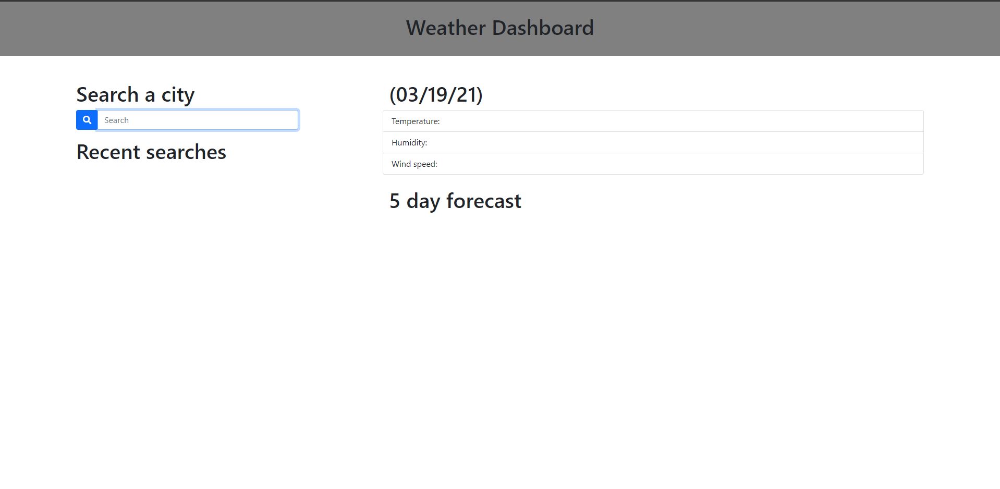
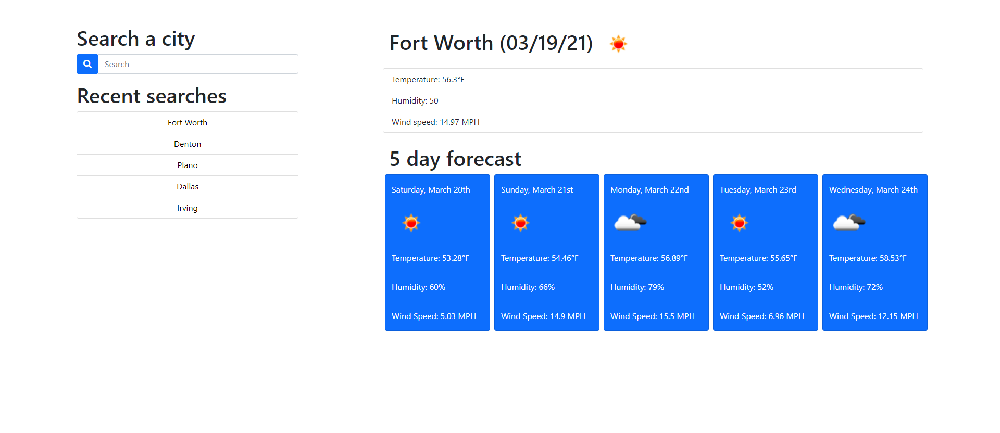

# weather-dashboard
For this assignment I was to create a dashboard for a user that gets weather data for a given city based on a search submission. I used the OpenWeather API for the daily and five day forecast. For the styling of the page I relied on Bootstrap, and really familiarized myself with jQuery.

Published page:
https://jpeiler97.github.io/weather-dashboard/

Screenshots:

